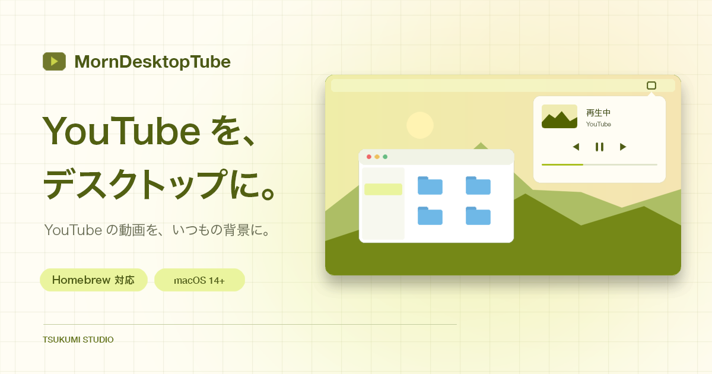

# MornDesktopTube

YouTubeをMacのデスクトップ背景で再生する、メニューバー常駐アプリです。
macOS 14以降対応。外部ブラウザは不要です。

## Homebrew での導入

```bash
brew install --cask tsukumistudio/tap/morndesktoptube
```

## Homebrew での更新

```bash
brew update
brew upgrade --cask morndesktoptube
```

更新後はアプリを起動し直してください。アプリ内の「更新を確認」からも更新できます。

## Homebrew でのアンインストール

```bash
brew uninstall --cask morndesktoptube
```

## 使い方

1. アプリを起動し、メニューバーの「ブラウザを開く」を押します。
2. 動画を再生して「背景に表示」を押します。
3. メニューバーから動画の切り替え・再生／一時停止・シーク・音量を操作できます。
4. 背景と再生を止めるには、赤い「背景を中止」を押します。

「この動画をリピート」をオンにすると、現在の動画を繰り返します（広告・ライブ配信を除く）。設定は次回起動時も保持されます。

最後に再生した動画を記憶し、次回起動時に背景で自動再生します。

## ライセンス

[The Unlicense](LICENSE)
